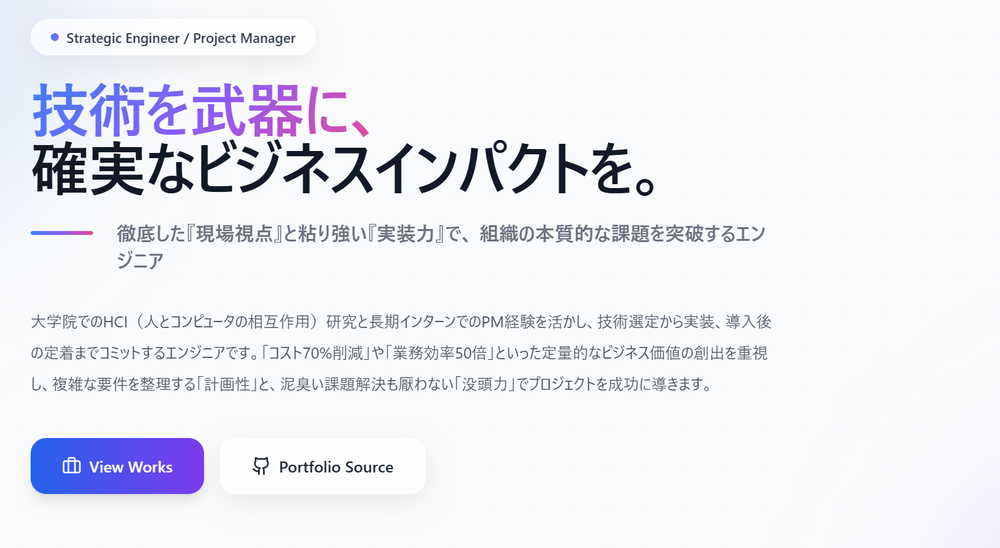

# Portfolio | 藤井 琢也 (Takuya Fujii)


> **「表面的な課題ではなく、本質を見抜き、ビジネス価値を創出する。」**
> 隠れた需要の発掘と緻密な実装力で、新しい価値を創造するエンジニア、藤井琢也のポートフォリオサイトです。

<br />

<div align="center">
  <a href="https://takutaku14.github.io/portforio-app/">
    
  </a>
</div>

<br />



<br />

---

## ✨ 30 秒でわかる私の強み

私の原動力は、**「表面的な課題ではなく、本質を見抜く力」**です。標本調査やデータ分析を通じて隠れた需要を発掘し、独自の解決策でビジネス価値を創出します。

| 🎯 成果                | 📝 概要                                                                                                        |
| :--------------------- | :------------------------------------------------------------------------------------------------------------- |
| **コスト 70%削減**     | 標本調査で「外部情報の調査」という隠れたニーズを発見し、「社内業務に特化した AI パートナー」という独自解を創出 |
| **業務効率 50 倍向上** | 画像処理プラットフォームの開発により、1 件 10 分の作業を 12 秒に短縮                                           |

> 💡 **表面的な解決策ではなく、データに基づく仮説検証と論理的な戦略立てで本質を見抜き、確実に結果を出します。**

<br />

---

## 🎨 デザインへのこだわり — プロ品質の UI/UX 設計

私はまず、**Apple Human Interface Guidelines（HIG）** の設計哲学をベースに、あらゆるプロジェクトで再利用可能な汎用デザイン基盤 **[Universal Design Base Framework](DSIGN_BASE.md)** を策定しました。

そして、AI エージェントプロジェクトにおいてこのデザインベースをさらに応用し、プロジェクト専用のデザインルールを作成。一貫性のある高品質な UI を構築しました。

### なぜデザインルールを作成したのか？

チーム開発において「デザインの属人化」は大きな課題です。私は以下の問題を解決するため、体系的なデザイン基盤を整備しました：

- ❌ 担当者によって UI のトーンがバラバラ
- ❌ 「なんとなく」の感覚的なピクセル調整
- ❌ ダークモード対応時に色の定義が破綻

### 策定したデザインルールの特徴

| 原則                     | 内容                                                         | ユーザーへのメリット               |
| :----------------------- | :----------------------------------------------------------- | :--------------------------------- |
| **8pt グリッドシステム** | すべての余白・サイズを 8 の倍数で統一                        | 視覚的な心地よさと整理された印象   |
| **セマンティックカラー** | 「青=#3B82F6」ではなく「primary=ブランドカラー」と役割で定義 | ダークモードでも自然な配色         |
| **WCAG 2.1 AA 準拠**     | 文字と背景のコントラスト比を保証                             | 誰でも読みやすいテキスト           |
| **アニメーションの原則** | ユーザー操作から 100ms 以内にフィードバック開始              | 「動作が軽い」と感じる快適な操作感 |
| **タップ領域の確保**     | ボタン等のタッチ領域を最低 44x44px 保証                      | スマホでもストレスなく操作可能     |

> 📄 **詳細は [DSIGN_BASE.md](DSIGN_BASE.md) をご覧ください。**
>
> このドキュメントは、今後のプロジェクトでも再利用できる「デザインの教科書」として活用できます。

<br />

---

## 📖 概要 (Overview)

私のエンジニアとしてのスキルセット、経歴、そして「ビジネスインパクト」にこだわったプロジェクト実績を紹介するシングルページアプリケーション（SPA）です。

単なる自己紹介サイトではなく、**読み手（採用担当者様）の体験**を最優先に設計しました。情報のスキャナビリティ（読みやすさ）と、アプリとしての快適な操作性を両立させています。

<br />

---

## 🛠 技術スタック (Tech Stack)

| Category       | Technology   | Why I chose it                                                                 |
| :------------- | :----------- | :----------------------------------------------------------------------------- |
| **Frontend**   | React 19     | コンポーネント指向による再利用性と状態管理の効率化のため                       |
| **Build Tool** | Vite 7       | 高速な HMR（Hot Module Replacement）による開発体験の向上と、ビルド最適化のため |
| **Styling**    | Tailwind CSS | クラス名管理のコスト削減と、デザインシステム（Apple 風 UI）の迅速な構築のため  |
| **Icons**      | Lucide React | 軽量で統一感のある SVG アイコンセットを採用し、視認性を確保                    |
| **Deploy**     | GitHub Pages | CI/CD パイプライン（GitHub Actions）との親和性を考慮                           |

<br />

---

## ⚡️ エンジニアリングのこだわり (Key Engineering Highlights)

<details>
<summary><strong>🔍 クリックして技術的な詳細を展開</strong></summary>

<br />

コードを見る際は、特に以下の実装ポイントにご注目ください。

### 1. パフォーマンス最適化 (Performance)

ユーザー体験を損なわないよう、徹底的な軽量化を行っています。

- **Intersection Observer API:** スクロール連動アニメーションにおいて、監視ロジックを最適化し、要素が表示された瞬間に監視を解除（`disconnect`）することでメモリリークと不要な再レンダリングを防止しています。
- **`will-change` プロパティ:** CSS ハードウェアアクセラレーションを適切に有効化し、アニメーション時の GPU 負荷を最適化しました。

### 2. コンポーネント設計と UI/UX (Architecture & UX)

- **Apple Human Interface Guidelines** を意識した、清潔感と信頼感のあるデザインシステムを構築。
- **Atomic Design** の思想を取り入れた再利用可能なコンポーネント設計（Card, Badge, SectionHeader 等）。
- 実績画像の閲覧体験を向上させるため、**カスタムカルーセル（スライドショー）機能**をモーダル内に実装。

### 3. アクセシビリティ (a11y)

- セマンティックな HTML 構造（`<main>`, `<section>`, `aria-label`）を意識。
- 十分なコントラスト比の確保と、キーボード操作への配慮。

</details>

<br />

---

## 📂 ディレクトリ構成 (Project Structure)

主要なファイル構成は以下の通りです。

```text
root
├── public/
│   └── images/          # 実績画像（WebP/PNG最適化済み）
├── src/
│   ├── App.jsx          # メインロジックとコンポーネント構成
│   ├── App.css          # グローバルスタイル
│   ├── index.css        # Tailwindディレクティブとカスタムユーティリティ
│   ├── main.jsx         # エントリーポイント
│   └── assets/          # 静的アセット
├── DSIGN_BASE.md        # デザイン基盤ドキュメント
├── vite.config.js       # Vite設定
└── tailwind.config.js   # デザインシステム設定
```

<br />

---

## 🚀 ローカルでの実行方法 (Getting Started)

リポジトリをクローンし、以下のコマンドでローカル環境を立ち上げることができます。

```bash
# 1. Clone the repository
git clone https://github.com/takutaku14/portforio-app.git

# 2. Navigate to the directory
cd portforio-app

# 3. Install dependencies
npm install

# 4. Start the development server
npm run dev
```

<br />

---

## 📬 Contact

もし私の経歴や技術に興味を持っていただけましたら、ぜひご連絡ください。

- **GitHub:** [takutaku14](https://github.com/takutaku14)
- **Portfolio:** [takutaku14.github.io/portforio-app](https://takutaku14.github.io/portforio-app/)

---

© 2025 Takuya Fujii. All Rights Reserved.
